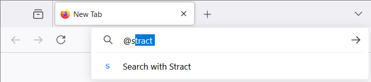

# Stract Search Engine

Adds the Stract search engine to your firefox browser. In the URL bar you simply type

`@stract search_query`

There is currently no support for [optics](https://stract.com/settings/optics) or similar things.

This project is based on [firefox-yt-addon](https://github.com/atahabaki/firefox-yt-addon) by [atahabaki](https://github.com/atahabaki). I liked to have something similar for Stract also so this is why I created this fork.

## Screenshots

## How does this work?

Firefox has `chrome_settings_overrides.search_provider` to add your search engine to the omnibox. To learn more, take a look at [MDN docs](https://developer.mozilla.org/en-US/docs/Mozilla/Add-ons/WebExtensions/manifest.json/chrome_settings_overrides).
